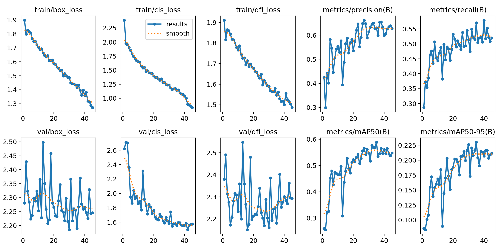
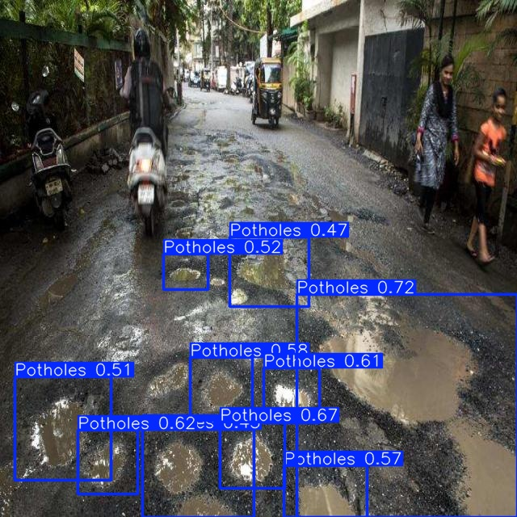
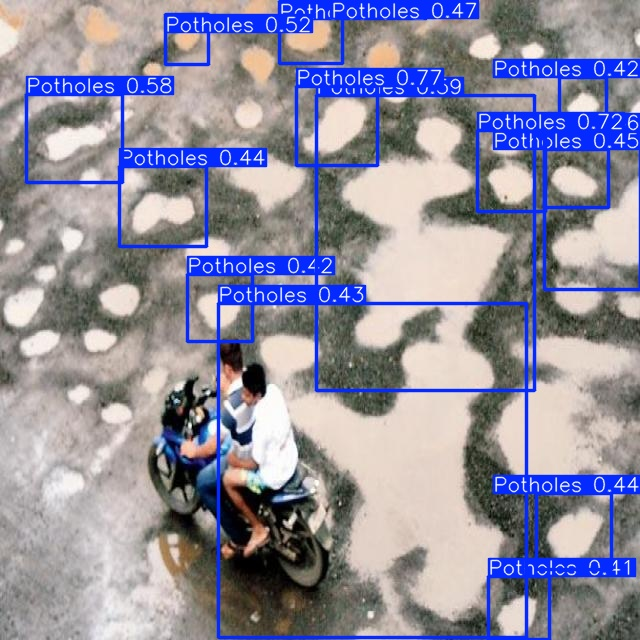

# Pothole Detection with YOLOv8 (PyTorch)

Real-time pothole detection using a fine-tuned YOLOv8 object detection model, built as a computer vision
follow-up to an earlier Raspberry Pi-based pothole/speed bump detection system I built during my degree.

## Problem
Road damage detection is a practical CV problem relevant to smart infrastructure and autonomous driving
systems. This project fine-tunes a YOLOv8 model to detect potholes in road images in real time.

## Approach
- **Model**: YOLOv8n (Ultralytics), initialized from COCO-pretrained weights, fine-tuned via transfer learning
- **Framework**: PyTorch (via Ultralytics YOLOv8)
- **Dataset**: 608 labeled road images with bounding-box annotations (pothole class), sourced from Roboflow Universe
- **Training**: 640x640 image size, batch size 16, early stopping (patience=10)
- **Augmentation**: default YOLOv8 augmentation pipeline (mosaic, flip, HSV jitter)

## Results

| Metric | Value |
|---|---|
| mAP@0.5 | 0.586 |
| mAP@0.5:0.95 | 0.230 |
| Precision | 0.626 |
| Recall | 0.569 |
| Inference speed | ~6.2ms/image on T4 GPU |
| Training | Early stopping (patience=10), YOLOv8n, 640x640 |
| Model size | 6.2MB, 3.0M parameters (YOLOv8n) |

### Training curves


### Sample detections



## Tech Stack
`Python` `PyTorch` `Ultralytics YOLOv8` `OpenCV` `Roboflow`

## What I'd improve next
- Larger/more diverse dataset (varied lighting, road types, camera angles)
- Compare YOLOv8n vs YOLOv8s/m for the accuracy/speed tradeoff
- Deploy on edge hardware (Raspberry Pi/Jetson) for real-time in-vehicle detection, extending my earlier
  Raspberry Pi-based prototype

## How to run
```bash
pip install ultralytics roboflow
python train_pothole_yolov8.py
```

## Background
This project revisits a problem I first tackled during my ECE degree (a Raspberry Pi + computer vision
pothole/speed bump detection system). This version rebuilds the detection pipeline with a cleaner,
reproducible YOLOv8 setup and is fully open-sourced here.
